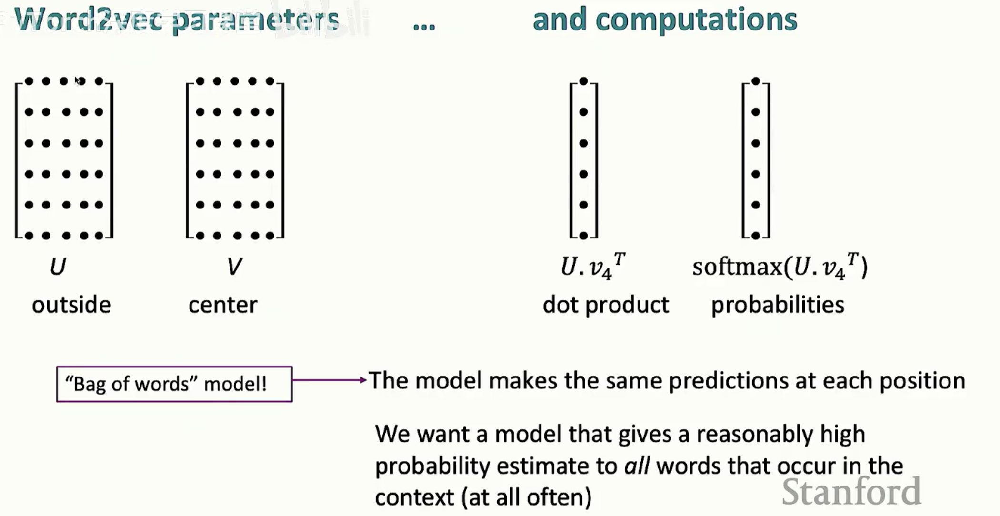

# word vectors
  ## one-hot向量
  one-hot向量无法展示词语之间的相似性且向量维度过高，为词表维度
  ## 词向量（嵌入/神经词）
  - 通过词周围的上下文词可了解词本身的含义
  - 将词表示为一个密集的，更短的密集向量
  - 如果词之间有联系，它们会有某种相似的向量，对应于它们的点积较大
  - 可以将其视为高维空间中的向量，将每个词嵌入为高维空间中的一个位置，空间的维度就是向量的长度
  - 可以捕捉词的不同含义以及词与词之间相似的方式
  - 对一个词，要做的是学习一种方法，基于上下文中与之共现的其他词，将所有词表示为向量，并将它们嵌入到这个向量空间中
  - 语义空间：在这个空间中，具有相似含义的事物彼此接近
  - 每个词的嵌入为所有词义的平均值，最终会与由两种词义在语义上共同激发的词相似
  ## word2vec（学习词向量的方法/基于局部窗口预测）
  - 有一长串词的列表（语料库），每个词都将被向量所表示，遍历文本中的每个位置，每个位置对应一个列表，将有一个中心词（C）和它外部的词
  （o），然后使用C和外部词的词向量相似度来计算它们应该出现的概率与否（给定c的情况下出现o的概率）；持续调整词向量并且最大化概率
  - 希望的是在彼此附近上下文中出现的词的共现概率很高
  - 相当于一个不断滑动的以c为中心的窗口，每次计算c和周围所有词的相似度和这个词出现在c附近i位置的概率 
  - 
  - 期望的是最大化这个似然，遍历文本中的每个位置，遍历上下文中的每个词，将它们相乘；这里采用负对数似然函数，最小化J就是最大化似然函数，目标函数J是平均负对数似然
  - 
  - c 表示 center word / 中心词（输入词）
  - vc表示这个中心词c的 *输入词向量（input embedding）*，模型读到中心词 c 时，用来代表它的那根向量
  - o表示 outside word / 上下文词（要预测的目标词），表示这个上下文词 o 的 输出词向量（output embedding）你可以理解为：模型在“输出端/被预测端”用来代表词 o 的那根向量
  - P(o|c)表示在训练语料里，当中心词是 c 时，它的上下文窗口里出现词 o 的概率（由模型给出的预测分布）。
  - 视为一个优化问题，我们有大量的文本，我们希望找到词向量，使得我们观察到的文本中词的上下文概率尽量地大；所以将为每个词从随机向量开始，需要调整这些向量，使得上下文中词的计算概率增加；持续调整直到它不再上升，我们能得到我们能得到的最高概率估计（使用到梯度下降方法）
  - 对每个单词：
    - 当w为中心词时表示为v_w
    - 当w为上下文词时表示为u_w
  - 本质是先假设出初始随机词向量，然后用梯度下降法拟合出正确的词向量
  - 全部且仅有的模型参数就是词汇表中每个词的词向量
  - 参数量：词表数 * 词向量维度 * 2
  - 特别的，只计算对中心词的偏导数 
  - 一般使用随机梯度下降（SGD/小批量梯度下降）
    - 选择数据的一个很小的子集，假装这就是所有的数据，基于这个小子集评估函数J，并基于这个小子集计算梯度（这是一个有噪声的，不准确的梯度估计；当在系统中引入一些噪声时，神经网络实际上通常工作得更好，系统中的这种噪声会让事物抖动并移动）
  - 
    - V表示中心词用的词向量矩阵（第c行是中心词c的向量v_c，U表示上下文词用的词向量矩阵,第w行是上下文词w的向量u_w
    - 从中心词向量v_c计算“每个词当上下文的概率”：
      - a）打分：把中心词向量v_c拿出来：scores=Uv_cT，等价于对词表里每个词w都算一个分数score=u_wTv_c(越相似内积越大)
      - b）softmax变成概率
    - 词袋模型：只要中心词是同一个c，模型预测上下文分布P就是同一个，不管这个上下文词出现在左边第一个位置还是第二个位置（不区分相对位置（-2，-1，1，2），只把窗口里的词当成一个袋子）
  - 词向量位置的应用：king-man+woman=queen（man之于king为woman之于“ ”）
  - 实践中最常用的平衡u和v的方案是取平均
  - 为什么用两个矩阵训练：
    - word2vec默认*一个词当中心词的行为与一个词当上下文词时的行为不必相同*，拆成两套参数更灵活
    - 两个矩阵互相提供学习信号，就像两个人拉扯着把内积调到合适大小
      - 当样本为（c，o）：我们希望u_oTv_c（真实上下文词概率）变大，u_wTv_c（无关词概率）变小 
      - 梯度同时更新：v_c，让他更接近u_o，远离被分到概率的u_w;u_o(以及其他相关u_w),让他更迎合/排斥这个v_c
      - U的作用可以理解为让v_cT乘上U来得到对所有上下文词的点积
      - 可理解为*V决定中心词怎么发出信号，U决定上下文词怎么接收信号*，两者一次把*哪些词该共现*刻进内积结构中
  - 负采样（negative sampling）：训练一个二分类的逻辑回归来区分：
    - 真实词对：中心词+窗口里真实出现的上下文词
    - 噪声词对：中心词+随机抽出来的词
    - 
    - 核心：把多分类改成*少量二分类*，确定一个问题：给定中心词c，这个词w是否是他的真实上下文词；于是吧真正的（c，o）标称正样本，从某个噪声分布中抽k个词构造副样本（c，k_i），每次只算k+1个内积；优化目标变为把真实上下文拉近，把随机词推远（内积变小）
    - 采样的概率分布取四分之三次方，能够做到提高不太频繁词的概率，通过更均匀地采样，获得更好的结果
  ## 基于计数的共现矩阵传统方法
    ### 基于SVD的传统计数共现矩阵方法
    - 获取一些计数，计算词在其他词的上下文中出现的频率，生成一个共现矩阵用这个来计算某种形式的词向量
    - 但不便使用，因为矩阵过大（length*length）
    - 要以某种方式减少矩阵的维度，因此我们就有一个更小的矩阵来处理，这时就能想到SVD 
    - SVD生成U∑V，，其中U和V彼此正交，中间的奇异向量按大小排序，是对不同维度数量的权重项，将最小的奇异向量设为0，更多的部分就会消失，只剩两个奇异向量时就能得到词的二维表示
    ### GloVe方法
    - GloVe算法：在这个模型中，向量空间中加减向量的线性组件对应于语义差异，将共现概率的比率转化为向量空间中的线性关系
    - 
     - 从共现计数矩阵开始，令P(x|ice)/P(x|steam)转变为线性组件，所以需要加入对数函数将比率转化为减法形式
    - 
     - 所以需要有一个对数双线性模型，其中两个词向量的点积对这个条件概率进行建模，两个向量之间的差异将对应于这个对数，即它们共现概率比率的对数
     - 对这个点积进行建模，使它接近共现概率的对数
     - 对第二条公式：
       - 左边：用上下文方向w_x去测量a和b的差向量wa-wb
       - 右边：对应的是x在a周围出现的概率与在b周围出现的概率的比值的对数，对数可把壁纸变成差
     - 对第三条公式：
       - X_ij:词i和上下文j的共现次数
       - w_i:i的词向量
       - wj´：上下文j的上下文向量
       - bi，bj´：偏置项
       - logX_ij:把共现次数取对数，压缩尺度，这个也是要拟合的目标
       - 平方：做的是最小二乘拟合
       - f(X_ij) :权重函数，决定哪些共现对值得认真拟合：太小的共现可能是巧合或噪声，太大的共现也必须控制，否则会在loss中占据过多地位；慢慢从0信到1，之后不变
  ## 基于预测的词向量与GloVe的区别
  - 预测类：
    - 训练：给定中心词，预测上下文词o的概率，训练就是让真实窗口里的上下文词概率更大（交叉熵，负采样等），是*局部窗口的逐样本预测*：每出现一次(center，context)就更新一次
    - 目标：模型里显式建模P(context|center)，用softmax/负采样去最大化它
  - GloVe：
    - 训练：让内积拟合logX_ij(共现计数的对数)：
      - w_iTW_j´+b_i+b_j´ ≈ logX_ij
    是*对整张共现矩阵做最小二乘回归*
    - 目标：不直接做预测概率的softmax，而是用全局统计X_ij(或其对数)，通过回归把它变成线性可拟合的形式
    - GloVe隐式地学到了条件分布结构，logP(j|i)=logX_ij - logX_i(X_i是词i的所有共现总次数，第i行求和)
    - 所以GloVe的bias中，b_i吸收了logX_i ，b_j´吸收上下文的整体频率（列方向的常数偏移），内积部分学到的是*谁和谁更相关*的结构部分
  ## CBOW和skip-gram的区别
  ### CBOW：context->w_c
    - 输入窗口中的上下文词（左右若干），输出中心词
    - 直觉：吧上下文词向量求和/平均成一个语境向量，用它去猜中心词
  ### skip-gram:w_c->w_o
    - 输入中心词，输出爽口里的每个上下文词
    - 直觉：用中心词向量去分别预测窗口中每个位置的上下文词
  ### 训练时区别
    - skip-gram：
      - 每次更新只更新中心词的输入向量和目标上下文词的输出向量，还会更新负采样出来的那些词的输出向量
      - 一次更新以一个pair（c->o_i）为单位，只涉及一个中心词输入向量和少量输出向量，一个窗口共2m个
    - CBOW：
      - 对一个窗口：输入是上下文向量的和/均值，更新窗口里所有上下文词的输入向量，更新中心词的输出向量，也会更新负采样词的输出向量
      - 一次更新以一个窗口为单位，会动到一堆上下文词的输入向量
    - 核心区别：CBOW会把窗口里的上下文向量求和/平均成一个h，用h预测中心词，反向传播时把梯度分到窗口里每个上下文词的输入向量上，每个中心词产生一个样本；skip-gram用中心词分别预测每个上下文词，可以拆成多次更新（每个pair做一次loss），也可以合并成一次更新（把这2m个上下文一起算loss，然后一次反向传播），每个中心词位置产生2m个样本
# 词向量的评估
  - 内在评估：
    - 执行一个非常特定的内部子任务尝试评分它是好还是坏
    - 通常内在评估计算速度快，但与下游任务有距离
  - 外在评估：
    - 有一些想要完成的实际任务如问答系统或机器翻译，想知道某些内部建模是否对该任务有所帮助，因此必须运行整个系统并计算下游准确度，并找出它是否真的有帮助 
    - 通常是间接的，很难判断任务中发生了什么