# 反向传播与神经网络

## 激活函数:为我们提供非线性函数
    - logistic（sigmoid）：f(z)=1/(1+exp(-z))
    - tanh(z)=(e^z-e^-z)/(e^z+e^-z)
    - tanh(z)=2logistic(2z)-a
    - hardTanh(z)=
      - -1 if x<-1
      - x if -1≤x≤1
      - 1 if x>1
    - ReLU(z)=max(z,0)
    - LeakyReLU:负方向有一个小斜率的ReLU
    - Swish(x)=x*logistic(x)
    - GELU(x)≈x*logistic(1.702x)

## 梯度下降
### 矩阵微积分基础
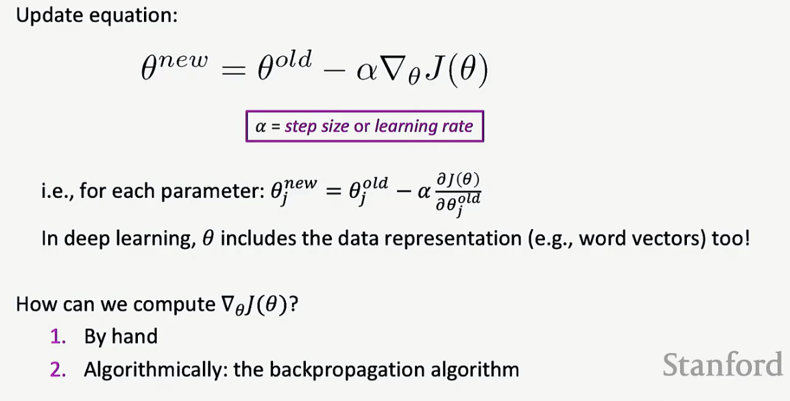
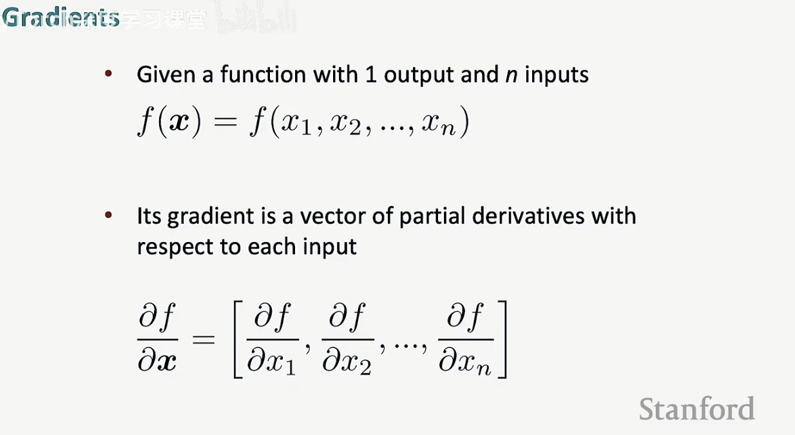
    - 计算有n个输入的函数的梯度，也就是他对每个输入的偏导数，梯度将是一个与输入数量相同大小的向量
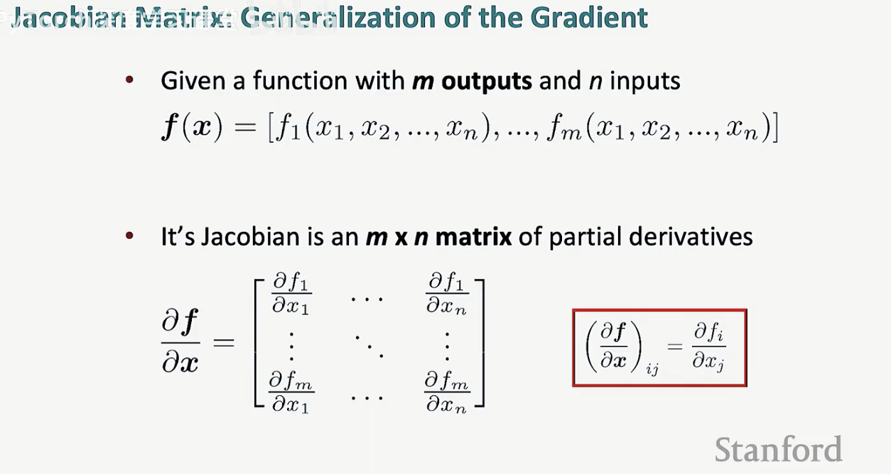
    - 具有n个输入和m个输出的函数，得到的梯度被称为*雅可比矩阵*
    - 也可以理解为多元函数对多元变量的偏导数排成的矩阵，一般是密集矩阵
    - 需要计算对于每个输出和每个输入，输入分量和输出之间的偏导数
    - 只要输入/输出有一个是多维的，做的就是Jacobian
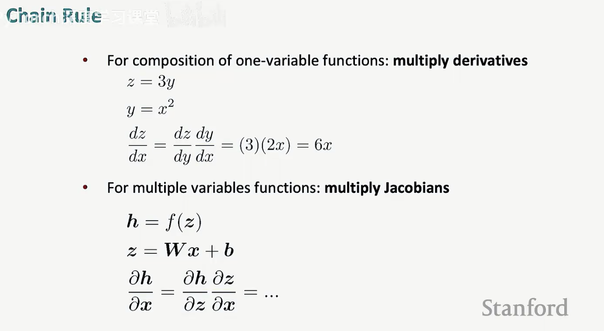
    - 神经网络有多层次的计算，对应于函数的组合
    - 将方程分解成各个组合在一起的独立部分
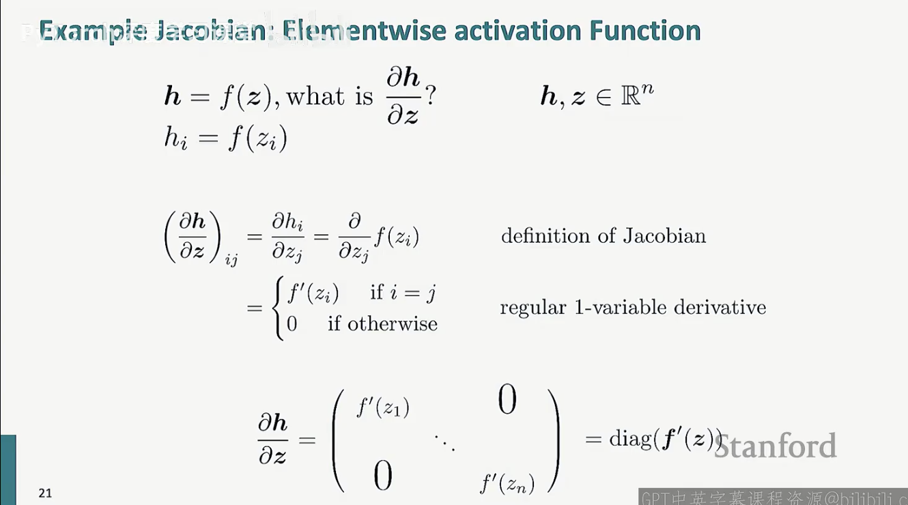
    - 逐元素的激活函数的偏导数则是对应输入的偏导数的对角矩阵
    - **第i个输出hi直以来第i个输入zi，不依赖其他zj，所以生成对角矩阵**
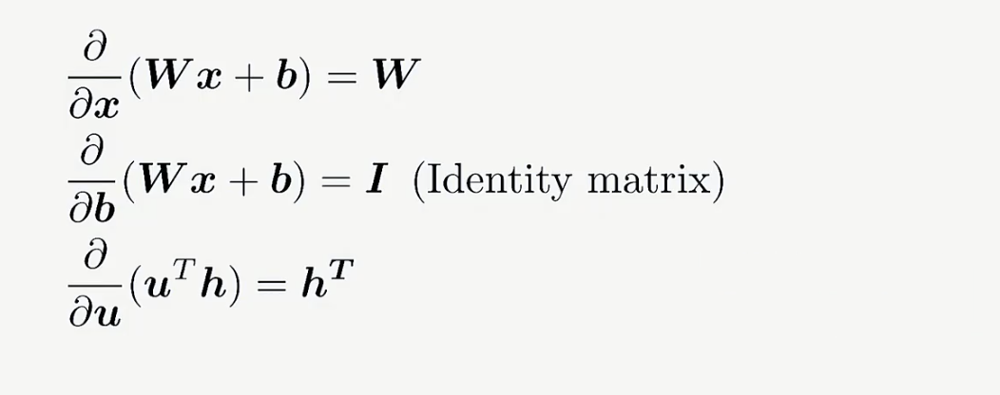
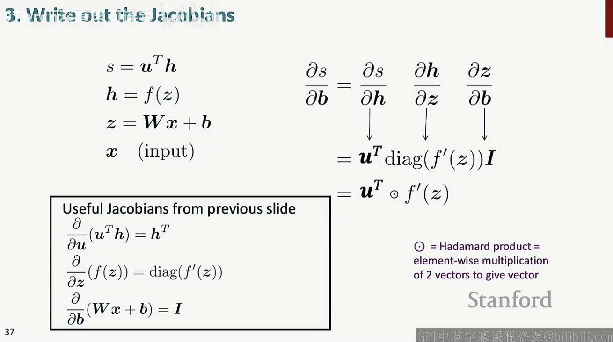
    - Hadamard积：逐元素乘法，把两个向量放在一起进行逐元素相乘，最终得到另一个相同类型的向量
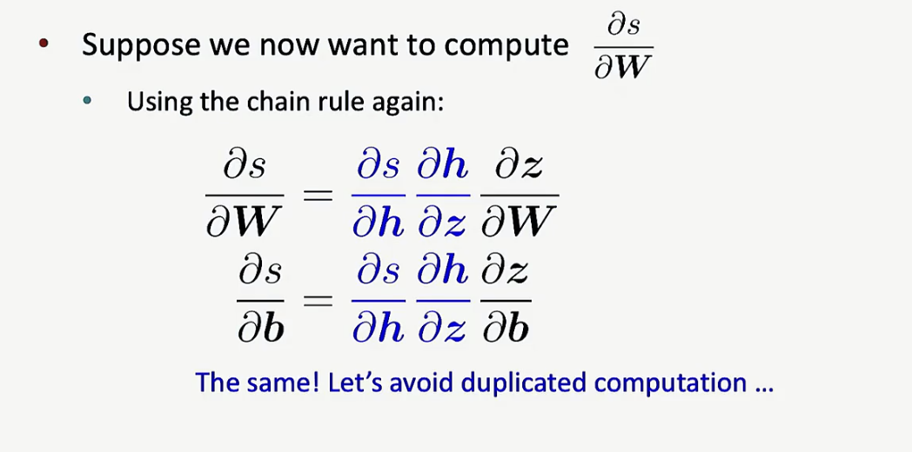
    - 在同一层上，不同参数的梯度的某些量是相同的
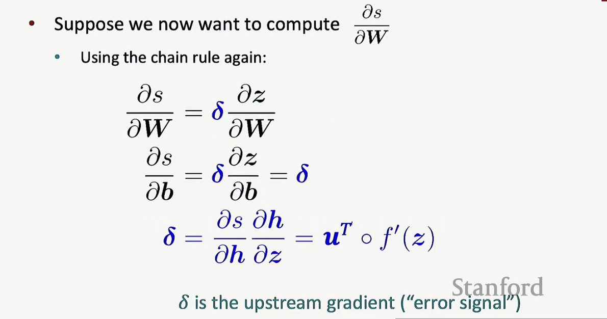
    - 因此可以重复使用重复的部分，设为delta，是上游梯度或者说是误差信号，是这一层共享的上游部分
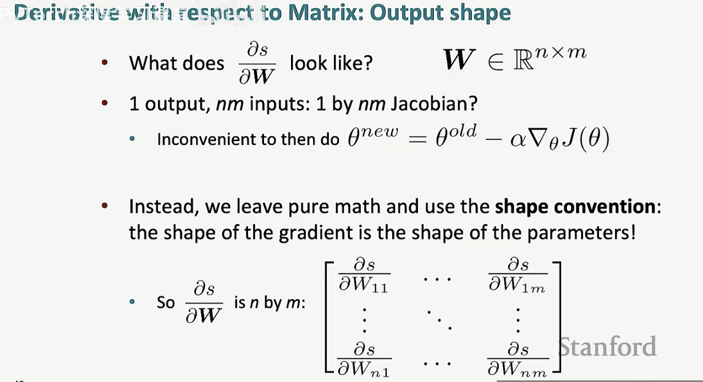
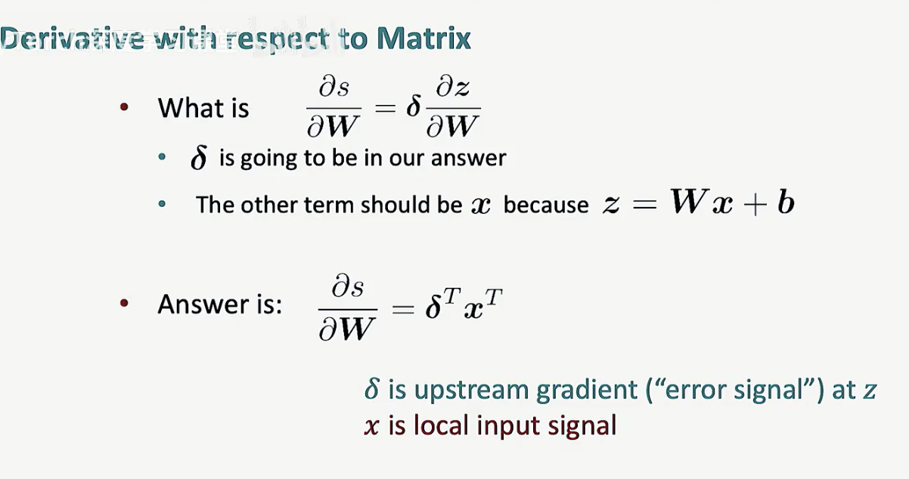
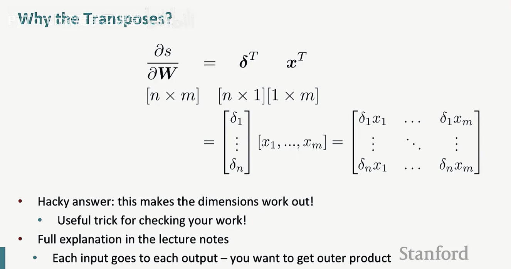
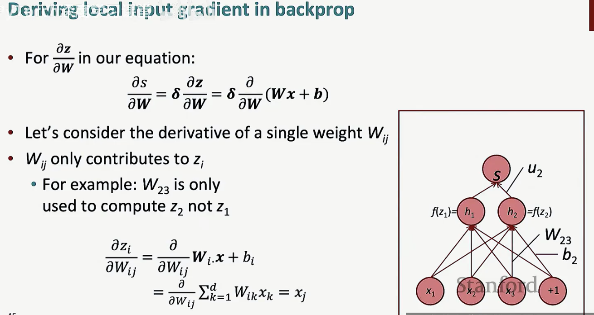
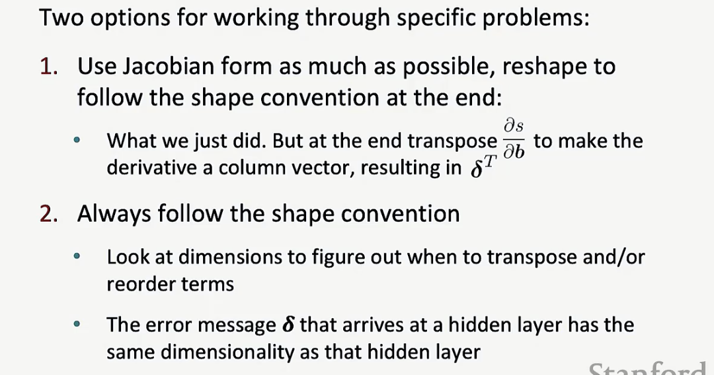
    - 出现的问题在于，∂s/∂b=hT˚f´(z)是一个行向量，但形状约束认为梯度需要是一个列向量因为b是一个列向量
    - 存在一个分歧：
      - 使用雅可比矩阵形式 ：使链式法则在进行链式法则时正确工作
      - 使用形状约定，使得执行SGD时，无论有什么类型的张量，减法，操作都很简单(计算关于某个矩阵的导数，它应该具有与该矩阵相同参数的形状)

### 反向传播算法（Backpropagation）
#### 要点
1.使用链式法则对复杂函数求导
2.存储中间结果，这样就不必再次重新计算相同的内容
#### 计算图和方向传播
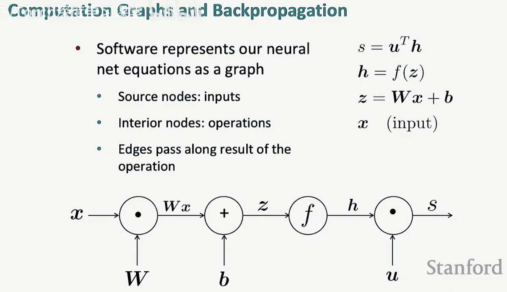
- 这被称为前向传播或神经网络的前向传递
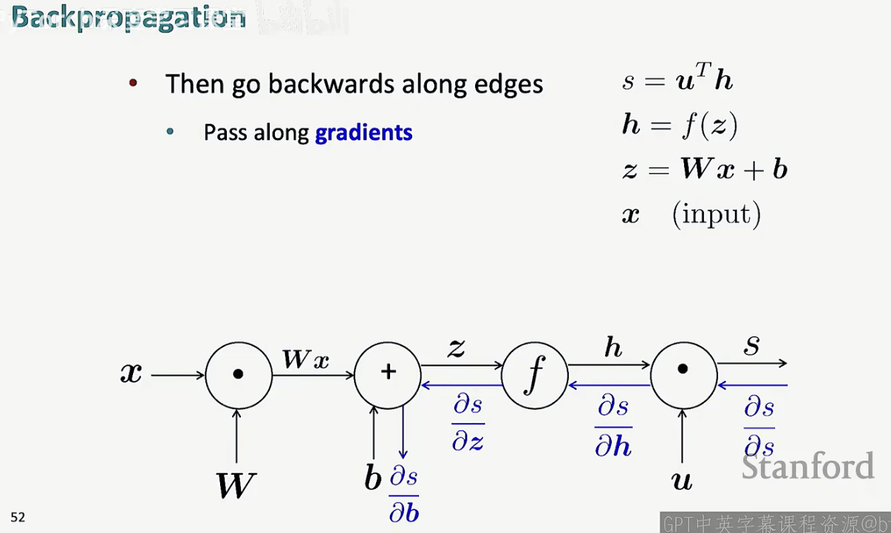
- 这是反向传播的流程
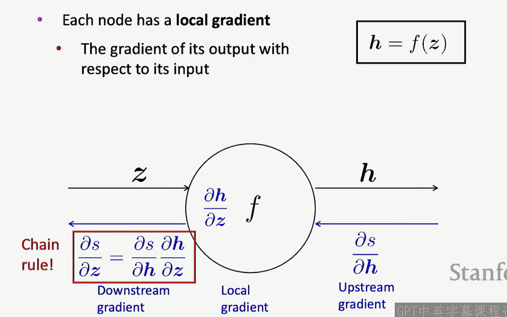
- 下游梯度等于上游梯度乘以局部梯度
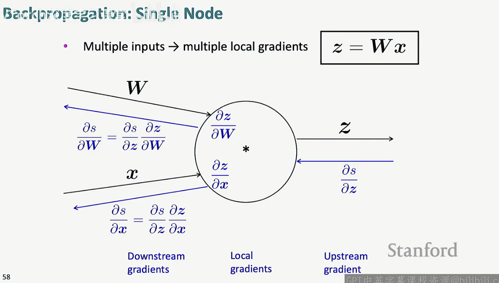
- 单个节点多个输入的情况下，依然有一个上游梯度，要做的是计算相对于每个输入的下游梯度，方式是计算相对于每个输入的局部梯度，然后对每个输入做上游梯度乘以局部梯度
一个例子：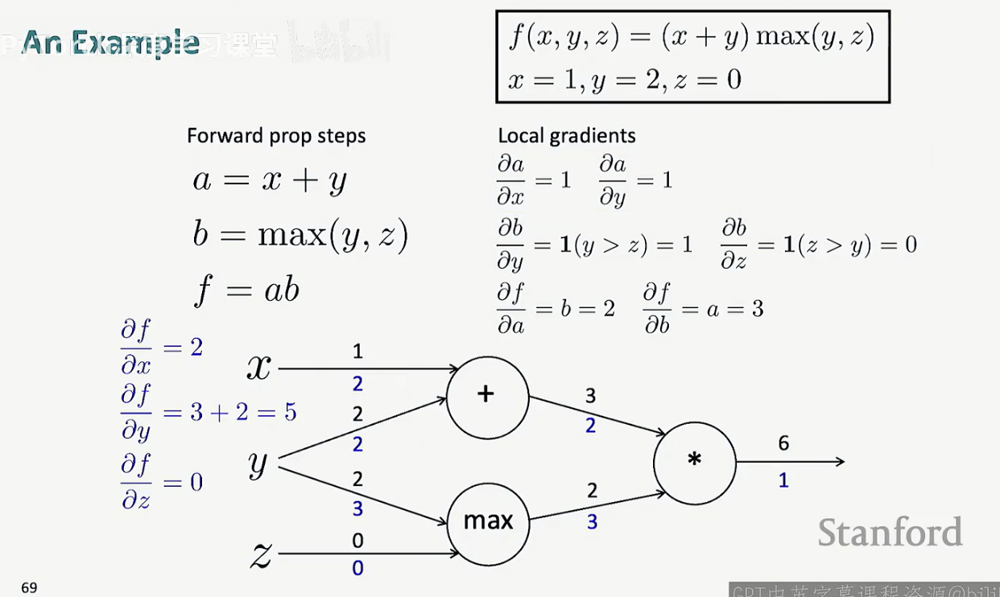
- 当计算图有分支时，所做的是将梯度相加
- 乘法是上游梯度乘以相反的前向系数，相当于前向系数的切换
- 加法是将上游梯度分发给每个输入，最大值函数将梯度发送给其中一个输入