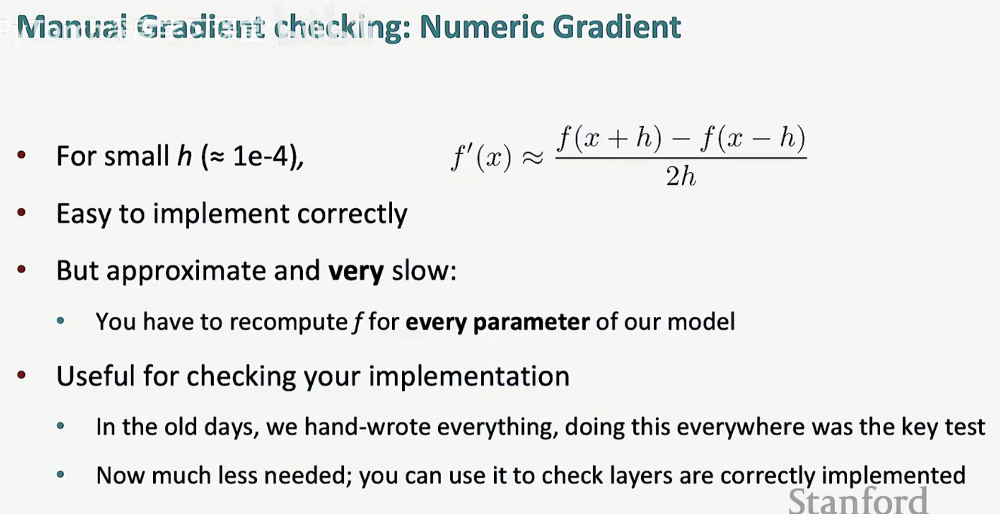
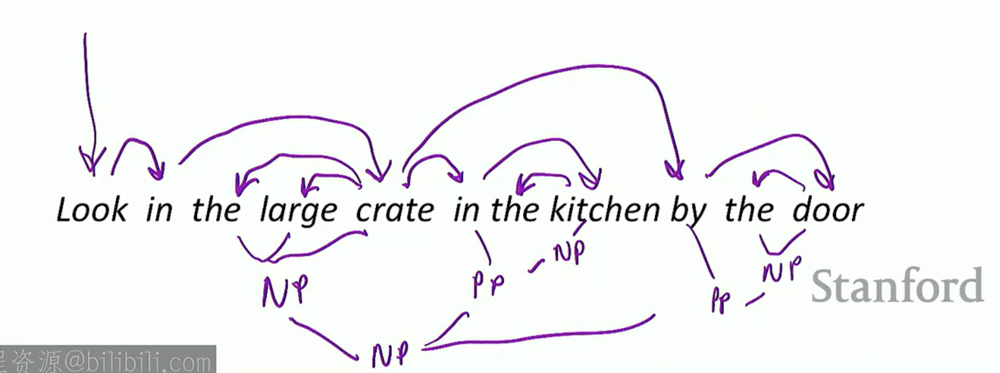
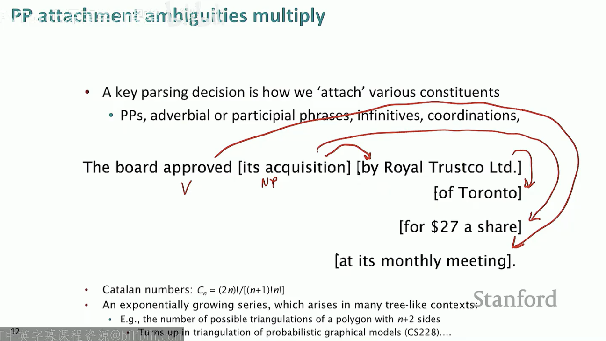
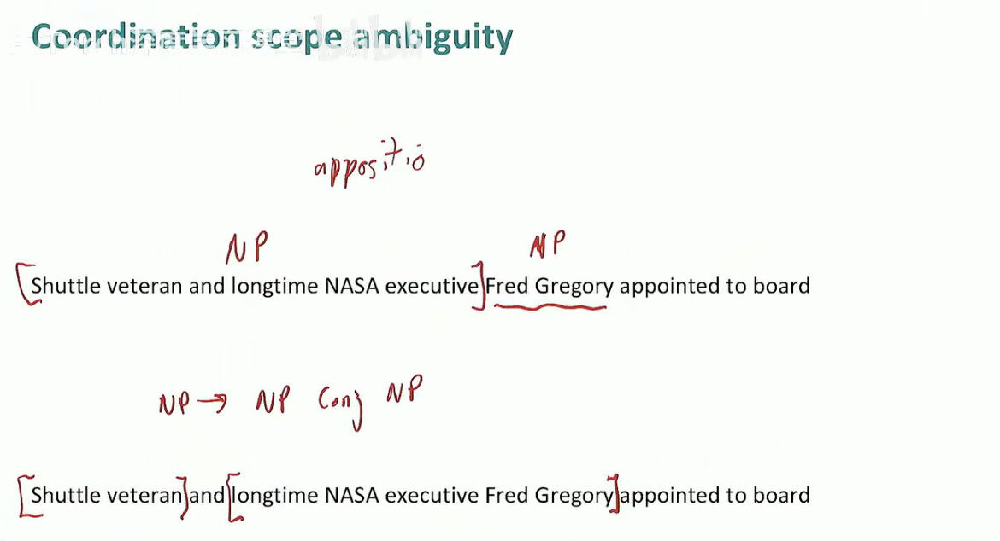
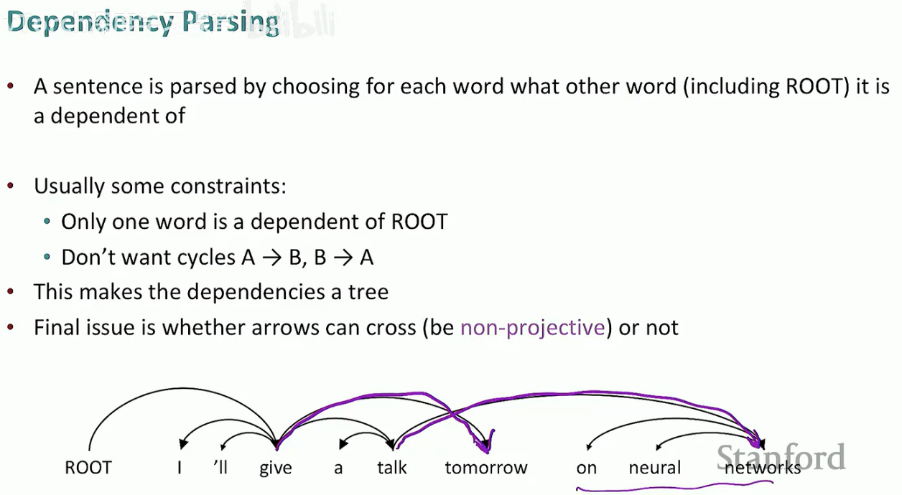
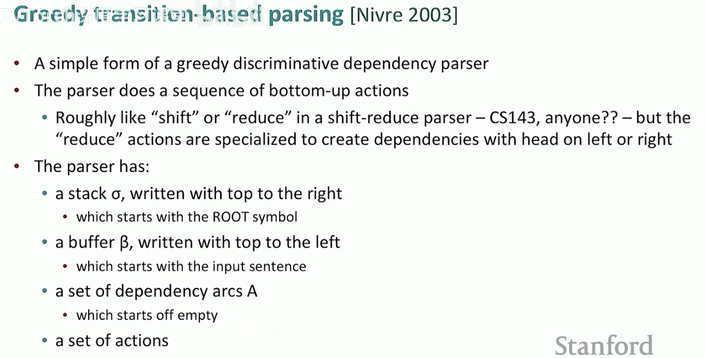
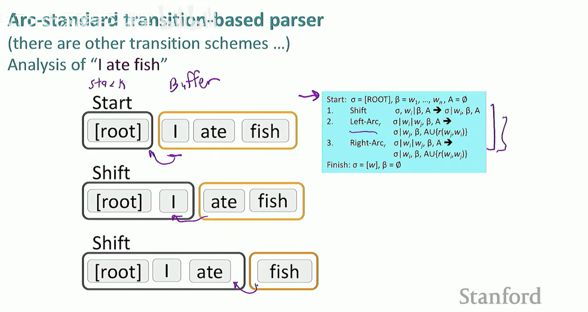
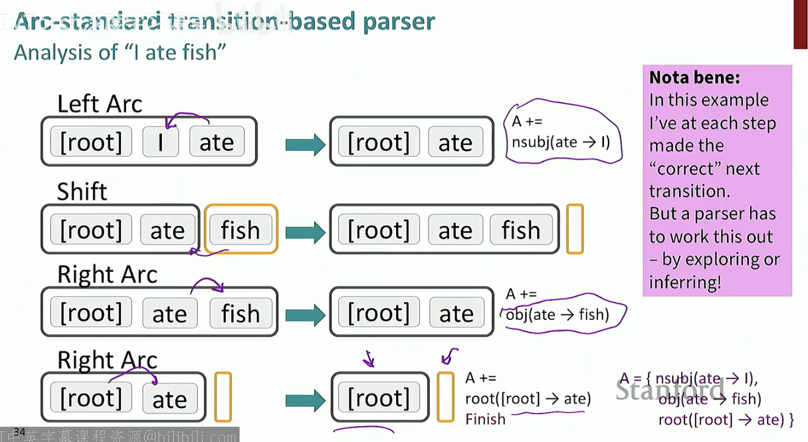
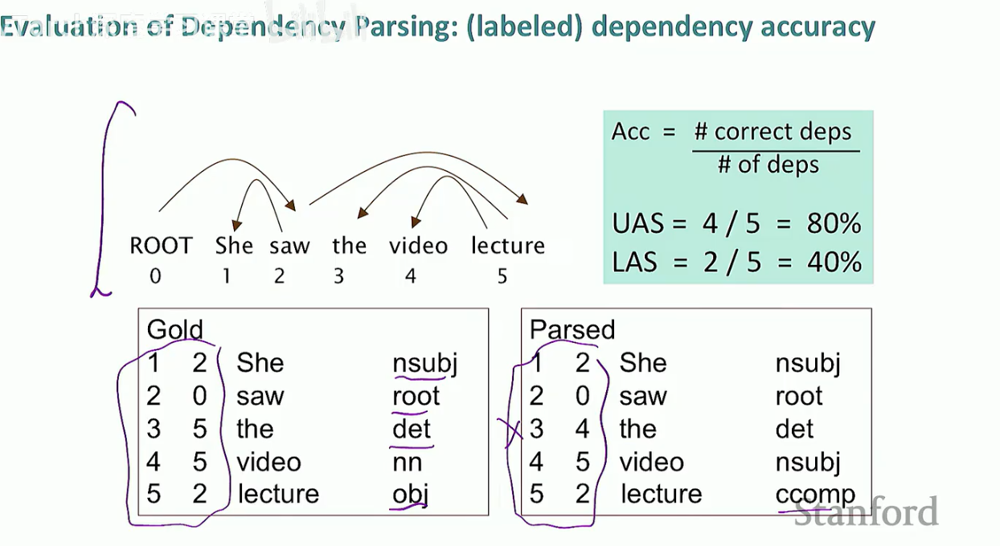
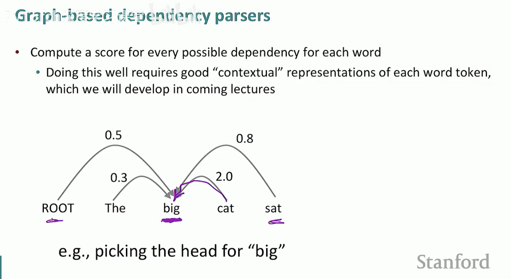

# 反向传播与神经网络

## 激活函数:为我们提供非线性函数
    - logistic（sigmoid）：f(z)=1/(1+exp(-z))
    - tanh(z)=(e^z-e^-z)/(e^z+e^-z)
    - tanh(z)=2logistic(2z)-a
    - hardTanh(z)=
      - -1 if x<-1
      - x if -1≤x≤1
      - 1 if x>1
    - ReLU(z)=max(z,0)
    - LeakyReLU:负方向有一个小斜率的ReLU
    - Swish(x)=x*logistic(x)
    - GELU(x)≈x*logistic(1.702x)

## 梯度下降
### 矩阵微积分基础

    - 计算有n个输入的函数的梯度，也就是他对每个输入的偏导数，梯度将是一个与输入数量相同大小的向量

    - 具有n个输入和m个输出的函数，得到的梯度被称为*雅可比矩阵*
    - 也可以理解为多元函数对多元变量的偏导数排成的矩阵，一般是密集矩阵
    - 需要计算对于每个输出和每个输入，输入分量和输出之间的偏导数
    - 只要输入/输出有一个是多维的，做的就是Jacobian

    - 神经网络有多层次的计算，对应于函数的组合
    - 将方程分解成各个组合在一起的独立部分

    - 逐元素的激活函数的偏导数则是对应输入的偏导数的对角矩阵
    - **第i个输出hi直以来第i个输入zi，不依赖其他zj，所以生成对角矩阵**

    - Hadamard积：逐元素乘法，把两个向量放在一起进行逐元素相乘，最终得到另一个相同类型的向量

    - 在同一层上，不同参数的梯度的某些量是相同的

    - 因此可以重复使用重复的部分，设为delta，是上游梯度或者说是误差信号，是这一层共享的上游部分

    - 出现的问题在于，∂s/∂b=hT˚f´(z)是一个行向量，但形状约束认为梯度需要是一个列向量因为b是一个列向量
    - 存在一个分歧：
      - 使用雅可比矩阵形式 ：使链式法则在进行链式法则时正确工作
      - 使用形状约定，使得执行SGD时，无论有什么类型的张量，减法，操作都很简单(计算关于某个矩阵的导数，它应该具有与该矩阵相同参数的形状)

### 反向传播算法（Backpropagation）
#### 要点
1.使用链式法则对复杂函数求导
2.存储中间结果，这样就不必再次重新计算相同的内容
#### 计算图和方向传播

- 这被称为前向传播或神经网络的前向传递

- 这是反向传播的流程

- 下游梯度等于上游梯度乘以局部梯度

- 单个节点多个输入的情况下，依然有一个上游梯度，要做的是计算相对于每个输入的下游梯度，方式是计算相对于每个输入的局部梯度，然后对每个输入做上游梯度乘以局部梯度
一个例子：
- 当计算图有分支时，所做的是将梯度相加
- 乘法是上游梯度乘以相反的前向系数，相当于前向系数的切换
- 加法是将上游梯度分发给每个输入，最大值函数将梯度发送给其中一个输入

- 检查梯度是否计算正确

# 语言结构
## 短语结构(成分语法)：通常以上下文无关语法表示
### words
- Noun
- adj
- Det（determiner:限定词/冠词）
- prep
### Phrase
- NP:the cuddly cat,the door
- PP:by the door
### phrases combine into bigger phrases
- the cuddly cat by the door:NP
### phrase structure
NP->Det N
NP->Det(Adj)N
NP->NP PP
PP->P,NP
VP->V PP
- example
Det->a,the
adj->large...
prep->in,on,under 
VP->talk to

## 依存结构(Dependency Structure)
- 考虑哪些词是主要词或核心词，以及这些词将哪些词作为修饰语或论元
- 核心词指向依存词
- example:
  - 
  - 中心词是looking，对象是crate，剩下的修饰词都是修饰crate的
- 基本想法：当人类交流时，以线性流的方式交流，核心是弄清楚什么修饰什么

- 介词短语导致的歧义
- 有四个介词短语时会得到13种解读

- 并列范围导致的歧义
- apposition：同位语
### 构建依存句法分析
- 
  - on neural networks修饰talk，tomorrow修饰give
  - 得到这些交叉依存关系，被称为**非投射性(non-projective)**
### 实践中最常见的方式是基于转换的句法分析
- 
- 
  - 首先将root符号放在栈上，缓冲区(buffer)有句子的所有单词
  - 对于处理的每一步，有三种操作可以选择
    - 可以进行移位(shift)，将缓冲区顶部的单词移到栈上
    - 左弧或右弧(两种规约reduce operation，通过表明一个词是另一个词的依存词，以左方向或右方向，构建一点语法结构)
- 
    - 对于取左弧，取栈顶的两个元素，并使栈顶的元素成为中心词栈中第二个元素成为它的依存词(第一步实际上意味着i是ate的依存词(dependent))
    - 然后从栈中弹出依存词，并且添加了所构建的依存关系，即使i成为ate的依存词
    - 执行另一个移位操作，将fish从缓冲区移位到栈上
    - 然后执行右弧操作，表示使fish成为ate的依存词，然后fish从栈中弹出，并且添加新的依存关系
    - 再次执行右弧，表示ate是root的依存词
    - 此时栈中只剩下root，达到结束条件(缓冲区为空，并且栈只包含root)
- 这是一组基于转换的分析的转换操作，通过执行这些不同转换的序列，可以构建句子结构；选择执行哪些操作，决定了句法结构，即已经构建的依存关系集合 
- 使用机器学习构建解析器，通过制作一系列的转换，机器学习的任务是预测在每个时间点什么是正确的转换
  - 在每个节点只处理一个事情，因此解析一个句子所做的操作数量是线性的
  - 将这种转换预测序列作为机器学习操作来执行，这个序列会给你提供句子的句法结构
- 依存句法分析的评估
  - 
  - 等价于评估是否得到了正确的依存弧
  - 数字对表示依存关系，后者错误一个所以正确率为百分之八十
  - 有时人们只评估未标注的弧，所以被称为非标注依存准确率(UAS)
  - 若用主语，限定词，宾语来标注，则后者的正确率仅有40%
- 指示特征的问题是它们很稀疏；并不完整，有些词和组合训练数据中可能没有，所以会缺失特征；计算符号特征非常昂贵

### 神经网络基于转换的依存分析器
- 利用到了词嵌入，给词的不同词性不同的分布式表示，指示表示上彼此接近；依存关系标签类型也被赋予分布式表示
- 在对栈和缓冲区进行操作时，别的都一样，只是取出词语及其词性的分布式表示；同时若栈上的某些元素已经涉及到依存关系，还会为已构建的依存关系增加一点复杂性。
- 对于每一个元素，将获取它们的分布式表示，将它们连接在一起产生一个大向量，然后将它们输入到神经网络中
- 输入层是连接起来的分布式表示，通过隐藏层，通过softmax给出关于执行shift还是左弧还是右弧操作的概率分布

### 基于图的依存解析器

- 对于每个词，为每个词提出问题：我是什么的依存词？最终得到每种可能性的评分
- 最终需要评分n平方次
- 希望依存关系形成一棵树，需要找到最小代价生成树